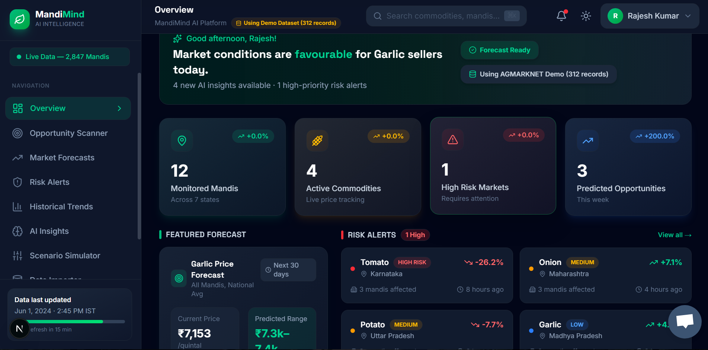
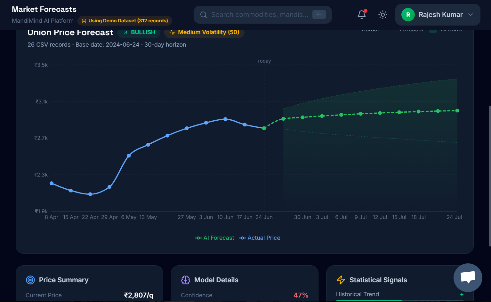
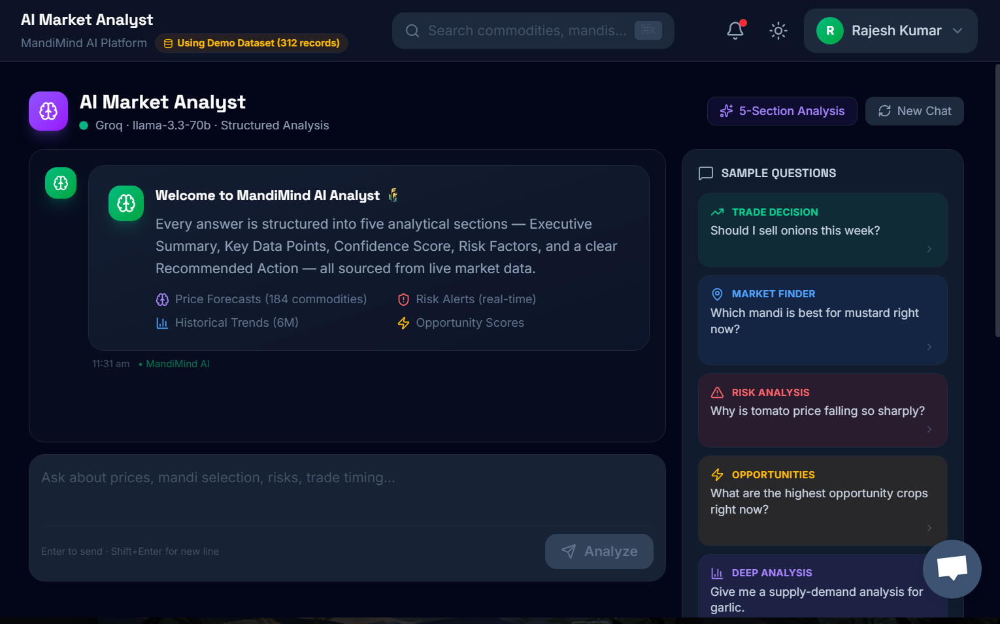

# vibe-coding-hackathon-2026-indias-largest-ai-web3-event-hackindia-kasukabe-coders
Hackathon team repository for Kasukabe Coders - [hackindia-team:vibe-coding-hackathon-2026-indias-largest-ai-web3-event-hackindia:kasukabe-coders]

# 🌾 MandiMind AI
### AI-Powered Mandi Intelligence Platform for Indian Agriculture

> **"Bloomberg Terminal for Indian Farmers — built on government open data, accessible to anyone."**

[](https://mandimind.vercel.app)
[]([https://your-demo-video-link](https://www.loom.com/share/bd5ea7c7657c4793a5fd4b1014c70c03?t=393))
[](#)
[](#)

---

## 🚨 The Problem

**Every year, Indian farmers, and agri-traders lose crores — not because of bad crops, but because of bad timing.**

- 📉 Farmers sell onions in Maharashtra right before a **18% price crash** — because they had no data
- 💸 Over **₹92,000 crore** worth of agricultural produce is lost annually due to wrong sell timing and market misinformation
- 📋 Only **23% of eligible farmers** actually receive PM-KISAN and other scheme benefits they qualify for
- 📊 **146 million farm households** in India — zero personalized market intelligence tools for them
- 🏦 FPOs managing crores of produce still make bulk selling decisions based on **WhatsApp forwards and gut feeling**

> **The people who need market intelligence the most are the ones who have never had access to it.**

---

## 💡 The Solution — MandiMind AI

MandiMind AI is an **agricultural market intelligence platform** that transforms raw AGMARKNET government data into actionable price forecasts, opportunity scores, risk alerts, and AI-powered sell/hold recommendations — built specifically for **FPOs, agri-traders, and procurement companies**.

### What makes it different?

| Traditional Approach | MandiMind AI |
|---|---|
| Sell based on gut feeling | AI-powered 30-day price forecasts |
| Check one mandi at a time | Scan 500+ mandis simultaneously |
| React to price crashes | Get risk alerts **before** they happen |
| Miss government schemes | Scenario simulation to plan ahead |
| Hire expensive consultants | AI market analyst available 24/7 |

---

## 🎯 Who Is This For?

**Primary customers — B2B:**
- 🏢 **Farmer Producer Organisations (FPOs)** — 1.3 lakh FPOs managing bulk selling decisions
- 🚛 **Agri-traders and procurement companies** — need price intelligence across multiple mandis
- 🏦 **Agri-fintech companies** — need market data for loan and insurance underwriting

**Why FPOs specifically?**
FPOs manage 500–5,000 farmers collectively, make bulk decisions worth crores, and have at least one person who can use a dashboard. They're the perfect B2B customer — high value, real pain, and currently underserved.

---

## ✨ Key Features

### 📈 1. AI Price Forecast Engine
- 30-day price forecasts with **confidence intervals**
- Powered by OLS Linear Regression + Holt Double Exponential Smoothing
- Volatility scoring and trend classification
- Confidence scores so you know **how much to trust the forecast**

### 🔍 2. Opportunity Scanner
- Ranks every commodity by **Opportunity Score (0–100)**
- Shows expected return, confidence level, and volatility
- Executive AI recommendations — **Buy / Hold / Sell / Diversify**
- One dashboard to scan the entire market in seconds

### ⚠️ 3. Risk Alert System
- Real-time **High / Medium / Low severity** alerts
- Detects anomalous price movements and unusual market behaviour
- Flags supply surges before they cause price collapses
- Derived directly from live AGMARKNET data

### 🔮 4. Scenario Simulator
- Simulate **"What if arrival increases 30%?"** — watch the forecast update live
- Model arrival shocks and demand shocks with elasticity modelling
- Compare base forecast vs simulated scenario side by side
- Risk score and opportunity score recalculate automatically

### 🤖 5. AI Market Analyst (Powered by Groq + LLaMA 3.3)
Ask in plain English:
> *"Should I sell onion in Lasalgaon this week?"*

Get back a structured analysis:
- **Executive Summary**
- **Key Data Points** from historical trends
- **Confidence Score**
- **Risk Factors**
- **Recommended Action** — Hold / Sell / Diversify

### 📊 6. Historical Trends
- Visual price charts going back years
- Monthly aggregation across mandis and states
- Spot seasonal patterns the human eye misses

### 📤 7. Real Data Upload
- Upload any AGMARKNET CSV export
- Column mapping and validation built in
- Instant dataset switching — Demo ↔ Real data
- Dataset readiness diagnostics (prevents misleading forecasts)

---

## 🎨 User Experience & Interface Design

MandiMind AI is designed for fast decision-making in agricultural markets. The interface focuses on reducing information overload while surfacing the most critical insights first.

### Design Goals
* Present complex forecasting outputs in an understandable format
* Highlight risks and opportunities through visual indicators
* Maintain accessibility for users with varying technical expertise

### UX Highlights
* Clean dashboard-first workflow
* Color-coded risk severity indicators
* Interactive forecasting visualizations
* Responsive layouts for desktop and mobile devices
* Simplified navigation between intelligence modules

By prioritizing clarity over complexity, MandiMind AI helps users focus on actionable decisions instead of raw data interpretation.

---

## 🏆 Demo — The Moment That Wins

**Judge selects:**
```
Crop: Onion
Region: Maharashtra
Mandi: Lasalgaon
```

**MandiMind AI responds:**

```
📊 Historical trend analysis complete.
📅 Similar supply pattern detected in Oct 2022 and Nov 2024.
📦 Arrival quantity up 34% over past 14 days.
📉 Predicted price decline: 15–22% over next 14 days (78% confidence)
⚠️  Risk Score: HIGH
💡 Recommendation: Sell within 5 days or divert to cold storage.
```

Every Indian judge remembers the 2019 onion price crisis. This demo makes it personal.

---

## 🛠️ Tech Stack

### Frontend
- **Next.js 16** (App Router) — SSR for fast load
- **TypeScript** — type-safe codebase
- **Tailwind CSS** — clean, responsive UI
- **shadcn/ui** — professional component library
- **Recharts** — interactive price visualisations
- **Lucide React** — iconography

### Backend
- **Next.js API Routes** — serverless backend
- **Server Components** — efficient data fetching
- **CSV-based data layer** — AGMARKNET compatible

### AI & Intelligence
- **Groq API** — ultra-fast inference
- **LLaMA 3.3 70B** — market analysis and recommendations
- **OLS Linear Regression** — price trend modelling
- **Holt Double Exponential Smoothing** — 30-day forecasting
- **Isolation Forest logic** — anomalous market behaviour detection

### Deployment
- **Vercel** — edge deployment, zero config

### Data Source
- **AGMARKNET** — Government of India's official mandi price database (free, open data)

---

## 📸 Screenshots

> *(Add your screenshots here — Dashboard, Forecast, Scenario Simulator, AI Analyst)*

| Dashboard Overview | Price Forecast | AI Market Analyst |
|---|---|---|
|  |  |  |

---

## 🚀 Getting Started

### Prerequisites
- Node.js 18+
- Groq API key (free at [console.groq.com](https://console.groq.com))

### Installation

```bash
# Clone the repository
git clone https://github.com/HackIndiaXYZ/vibe-coding-hackathon-2026-indias-largest-ai-web3-event-hackindia-kasukabe-coders.git

# Navigate to project directory
cd vibe-coding-hackathon-2026-indias-largest-ai-web3-event-hackindia-kasukabe-coders

# Install dependencies
npm install

# Set up environment variables
cp .env.example .env.local
# Add your GROQ_API_KEY to .env.local

# Run development server
npm run dev
```

Open [http://localhost:3000](http://localhost:3000) in your browser.

### Environment Variables

```env
GROQ_API_KEY=your_groq_api_key_here
```

### Using Your Own AGMARKNET Data

1. Go to [agmarknet.gov.in](https://agmarknet.gov.in) → Download price arrival data as CSV
2. Navigate to `/dashboard/data-upload`
3. Upload your CSV and map columns
4. Switch dataset to "Uploaded" — all forecasts update automatically

> **Note:** Forecasting requires minimum 30 unique dates. Recommended: 180+ days for reliable predictions.

---

## 📁 Project Structure

```

mandi-mind/
├── data/
│   ├── demo/                          # Demo AGMARKNET datasets
│   ├── uploaded/                      # User-uploaded datasets
│   └── dataset-config.json            # Active dataset configuration
│
├── public/                            # Static assets
│
├── src/
│   ├── app/
│   │   ├── api/
│   │   │   ├── analyst/               # AI Market Analyst API
│   │   │   ├── dashboard/summary/     # Dashboard aggregation API
│   │   │   ├── forecast/              # Forecast API
│   │   │   ├── market-data/           # Market data APIs
│   │   │   ├── opportunities/         # Opportunity Scanner API
│   │   │   └── scenario/              # Scenario Simulator API
│   │   │
│   │   ├── dashboard/
│   │   │   ├── page.tsx               # Executive Overview
│   │   │   ├── opportunities/         # Opportunity Scanner
│   │   │   ├── forecasts/             # Forecast Engine
│   │   │   ├── risk-alerts/           # Risk Alert System
│   │   │   ├── scenario/              # Scenario Simulator
│   │   │   ├── analyst/               # AI Market Analyst
│   │   │   ├── insights/              # AI Insights
│   │   │   ├── historical/            # Historical Trends
│   │   │   └── data-upload/           # AGMARKNET Import Workflow
│   │   │
│   │   ├── layout.tsx
│   │   ├── page.tsx                   # Landing Page
│   │   └── globals.css
│   │
│   ├── components/
│   │   ├── dashboard/                 # Dashboard UI components
│   │   ├── charts/                    # Recharts visualizations
│   │   ├── landing/                   # Landing page components
│   │   └── ui/                        # Shared UI components
│   │
│   ├── lib/
│   │   ├── csv-parser.ts              # AGMARKNET CSV parser
│   │   ├── market-data.ts             # Data access layer
│   │   ├── forecast.ts                # Forecasting engine
│   │   ├── scenario.ts                # Elasticity simulator
│   │   └── dashboard-helpers.ts       # KPI aggregation helpers
│   │
│   └── types/                         # TypeScript interfaces
│
├── package.json
├── tsconfig.json
├── next.config.ts
└── README.md
```
---

## 📊 The Market Opportunity

| Metric | Number |
|---|---|
| Farm households in India | 146 million |
| Registered FPOs in India | 1.3 lakh+ |
| Annual agri produce loss (wrong timing) | ₹92,000 crore |
| Farmers receiving entitled scheme benefits | Only 23% |
| Doctor:patient ratio for financial advisors | 0 per farmer |

**Revenue model:** SaaS subscription for FPOs at ₹2,999/month. 1% of India's FPOs = ₹3.9 crore ARR.

---

## 🗺️ Roadmap

**Phase 1 — Current MVP (Hackathon)**
- [x] Price forecasting engine
- [x] Opportunity scanner
- [x] Risk alert system
- [x] Scenario simulator
- [x] AI market analyst
- [x] AGMARKNET data integration

**Phase 2 — Post Hackathon (3 months)**
- [ ] WhatsApp bot integration (Hindi voice alerts)
- [ ] Seasonal ML models (SARIMA)
- [ ] Best Market Finder (top 5 mandis to sell in)
- [ ] Mobile app for field agents

**Phase 3 — Scale (6–12 months)**
- [ ] Blockchain crop yield credentials for micro-lending
- [ ] Government scheme eligibility checker
- [ ] FPO onboarding dashboard
- [ ] API for agri-fintech integrations

---

## ⚠️ Disclaimer

> Forecasts are based on AGMARKNET historical price and arrival data. MandiMind AI provides market intelligence to support decision-making — not financial advice. Always consult local market experts before making large-scale selling decisions.

---

## 👨‍💻 Team — Kasukabe Coders

| Name | Role |
|---|---|
| Durgesh Sharma | Full Stack + AI |
| Khushi Rathore | Frontend + Design |
| Kaustav Halder | Data + Backend |

*Built with ❤️ in Jaipur, Rajasthan for HackIndia Vibe Coding Hackathon 2026*

---

## 🏅 HackIndia Vibe Coding Hackathon 2026

This project was built for the **HackIndia Vibe Coding Hackathon 2026** under the **Startup Prototype** track.

- **Event:** HackIndia Vibe Coding Hackathon 2026
- **Track:** Startup Prototype + AI Native Apps
- **Team:** Kasukabe Coders
- **Built using:** Cursor, Claude AI, Next.js, Groq, Vercel

---

<div align="center">
  <strong>MandiMind AI — Because every farmer deserves a data analyst.</strong>
  <br><br>
  <a href="https://mandimind.vercel.app">🌐 Live Demo</a> •
  <a href="https://your-demo-video-link">🎥 Demo Video</a> •
  <a href="mailto:your@email.com">📧 Contact</a>
</div>

